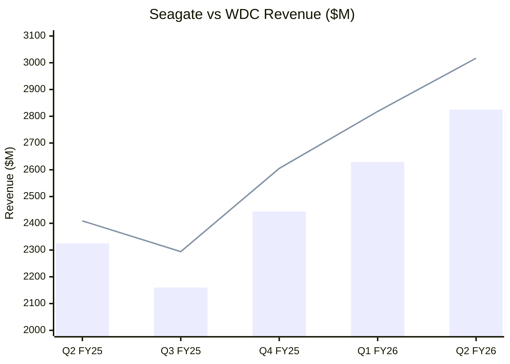

## A Place For Strategic Thoughts

Once you start to understand how to use [Obsidian](https://en.wikipedia.org/wiki/Obsidian_(software)), it becomes obvious that it is a great notepad, workpad, and overall place to categorize all of your thoughts. However, every once in a while you are going to want to share some of those thoughts. 

You have a couple of different ways of doing that, but [Markdown](https://en.wikipedia.org/wiki/Markdown) is especially suitable for being published directly to the web and still looking pretty good for something that takes very little effort. This particular website is created with [Quartz](https://www.ssp.sh/brain/quartz-publish-obsidian-vault/) and published through [GitHub Pages](https://docs.github.com/en/pages/getting-started-with-github-pages/what-is-github-pages). In essence, this makes it a free and easy way to share my thoughts with the world.

I have an inborn fascination with three theme:  the pursuit of business, the pursuit of productivity, and an intellectual understanding of if we are simply physical beings or if we have some attribute of our make-up that transcends beyond what we can observe with our senses.  This site serves to capture two of the three ideals in depth, and hint at the third.

## Why You Should Love Obsidian

LLM speak markdown.  Knowing markdown will help you in your workflow.

Table are the foundation of organizing your thoughts, and table are easy to make inside of Markdown, especially with a little help from an LLM.

Add in a little plug-in magic and you can massage tables into graphs for you to think through things with your visual center.

### 📐 Why Tables Help Us Organize Data

| Benefit | Explanation |
|---------|-------------|
| Clear Structure | Tables impose rows and columns, making relationships between pieces of information immediately visible. |
| Fast Scanning | The eye can jump across columns to compare items quickly without rereading paragraphs. |
| Reduced Cognitive Load | Information is chunked into predictable cells, freeing mental bandwidth for analysis instead of interpretation. |
| Easy Comparison | Tables align similar attributes, making differences and patterns stand out instantly. |
| Consistent Formatting | Uniform layout prevents drift, errors, and ambiguity—especially useful in long‑term notes or systems like Obsidian. |
## 📊 Google Lens Lets You Quickly Clip Table Data

| Quarter | Seagate Revenue ($M) | WDC Revenue ($M) |
|---------|------------------------|--------------------|
| Q2 FY25 | 2325                   | 2409               |
| Q3 FY25 | 2160                   | 2294               |
| Q4 FY25 | 2444                   | 2605               |
| Q1 FY26 | 2629                   | 2818               |
| Q2 FY26 | 2825                   | 3017               |
^260129STXvWDCRev

## Native Mermaid Support

Mermaid is a package that does standard graphing, and you can render to your static Quartz webpages to share with others.  This shows the table above with Seagate bars, and WDC as a line.



## 🔌Cool Plug-ins like "Charts" by phibr0 to graph the table

You can really do much better charts with the charts plug-in, but unfortunately it doesn't natively render to the web.  So, you only get the following, but shows nicely in Obsidian proper. 

<div align="center" style="font-size:1.5em;">

Seagate versus Western Digital Revenue

</div>

```chart
type: line
stacked: false
id: 260129STXvWDCRev
yMin: 0
yMax:
xTitle: "Quarter"
yTitle: "Revenue ($M)"
```
## Subreddits

[My thoughts on business and investments can be found here.](https://www.reddit.com/r/StrategicStocks/)

[My thoughts on personal productivity can be found here.](https://www.reddit.com/r/StrategicProductivity/)


## Getting Started If You Wanted To Do The Same

This site is built using [Quartz](https://quartz.jzhao.xyz/), a fast, batteries-included static-site generator.  This is a great package that leverages Github and Obsidian to make publication of parts of your notebook easy and fast.  

Update the page in Obsidian and simply run

```Powershell
npx quartz sync
```

If the advent of LLMs, the ability to deploy a site like this can be done by virtually anybody, as long as they want to put in the time.
